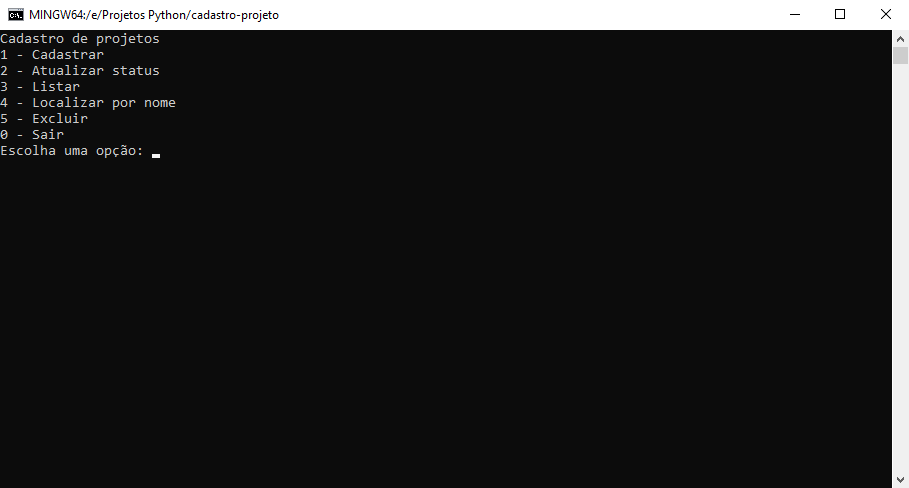

<h1 align="center">
  CRUD de Projetos
</h1>
<p align="center">
    Um aplicativo capaz de cadastrar, atualizar, listar e deletar dados de um projeto, além de localizar algum específico por nome.
</p>


<br />


## ⚙ Funcionalidades

### Cadastrar projeto
Para cadastrar um novo projeto, basta selecionar a opção "Cadastrar" no menu principal e preencher os dados solicitados: nome e status.

### Atualizar status do projeto
Para atualizar o status de um projeto existente, basta selecionar a opção "Atualizar status" no menu principal e digitar o nome do projeto que deseja atualizar, seguido do novo status.

### Listar projetos
Para listar todos os projetos cadastrados, basta selecionar a opção "Listar" no menu principal. Caso não haja projetos cadastrados, o sistema exibirá uma mensagem informando que não há projetos.

### Localizar projeto por nome
Para localizar um projeto específico por nome, basta selecionar a opção "Localizar por nome" no menu principal e digitar o nome do projeto que deseja buscar. O sistema exibirá o nome e status do projeto, caso exista na lista.

### Excluir projeto
Para excluir um projeto existente, basta selecionar a opção "Excluir" no menu principal e digitar o nome do projeto que deseja excluir. O sistema confirmará a exclusão e o projeto será removido da lista.

### Sair
Para sair do sistema, basta selecionar a opção "Sair" no menu principal. O programa será encerrado.


### 🧱 Tecnologias

- Python

## 🛠 Guia de instalação

1. Certifique-se de ter o Python instalado na máquina, e faça o clone do projeto.
    ```
    git clone https://github.com/jonathanBenedito/crud-projeto-python.git
    ```

2. Acesse o repositório
    ```
    cd crud-projeto-python
    ```

3. Execute o projeto
    ```
    python crud-projeto.py
    ```
